<p align="center">
  
</p>

<h1 align="center">Integration of LLMs with Conventional Systems for Autonomous Vehicles</h1>

<p align="center">
  A thesis repository presenting the integration of Large Language Models with conventional control approaches for autonomous vehicle systems.
</p>

<p align="center">
  
  
  
  
</p>

<p align="center">
  <a href="Amna_MAhmood_final_Thesis_Web.pdf"><b>Read the Full Thesis</b></a>
</p>

---

## Project Overview

This repository contains the complete thesis source, references, figures, diagrams, experimental visualizations, and final thesis PDF for the project. The visual material is organized chapter by chapter so the work can be reviewed directly from GitHub.

## Repository Contents

| Item | Description |
| --- | --- |
| `main.tex` | Main LaTeX thesis source |
| `first.tex` | Supporting LaTeX source |
| `mybib.bib` | Bibliography database |
| `Images/` | Original chapter figures and diagrams |
| `docs/previews/` | GitHub friendly PNG previews generated from PDF figures |
| `Amna_MAhmood_final_Thesis.pdf` | Final thesis document |

## Visual Summary

The repository currently contains **59 visual assets** across six chapters, including **30 raster images** and **29 PDF figures**. PDF figures are preserved in their original form and also rendered as PNG previews for GitHub.

### Selected Visuals

<table>
<tr><td align="center" width="50%"><a href="Images/CH_3/Methodology.pdf">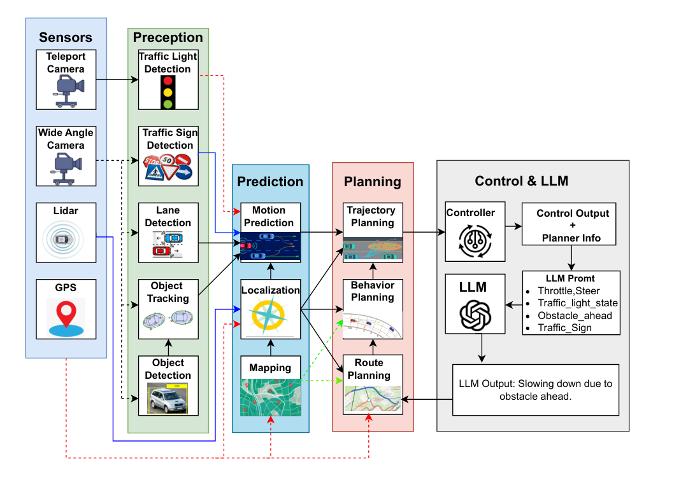</a><br><sub><b>Methodology</b></sub><br><sub><a href="Images/CH_3/Methodology.pdf">Open original PDF</a></sub></td><td align="center" width="50%"><a href="Images/CH_4/4.1.png">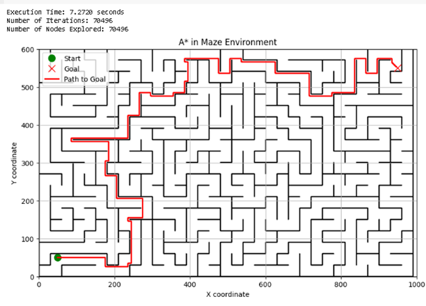</a><br><sub><b>4.1</b></sub><br><sub><a href="Images/CH_4/4.1.png">Open full image</a></sub></td></tr>
<tr><td align="center" width="50%"><a href="Images/CH_5/Figure%205.1.png"></a><br><sub><b>Figure 5.1</b></sub><br><sub><a href="Images/CH_5/Figure%205.1.png">Open full image</a></sub></td><td align="center" width="50%"><a href="Images/CH_6/6.1.pdf">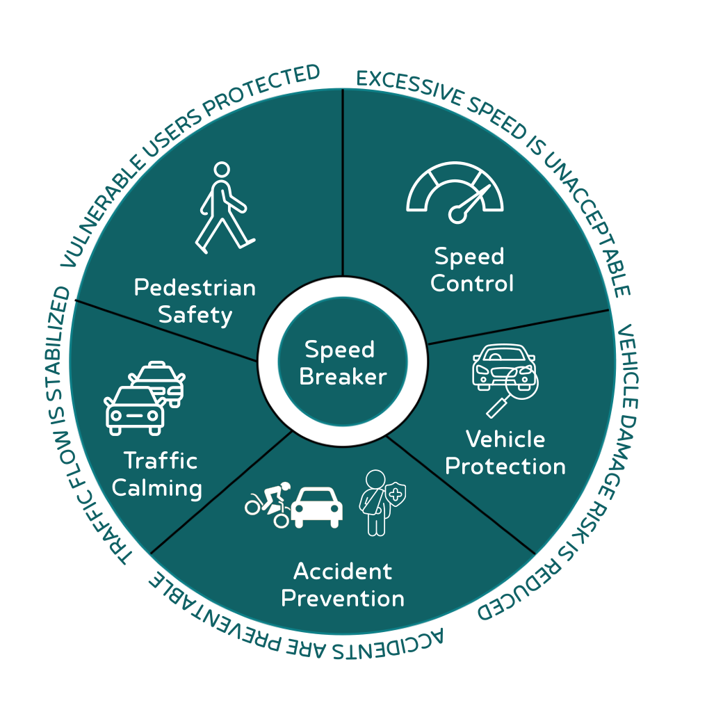</a><br><sub><b>6.1</b></sub><br><sub><a href="Images/CH_6/6.1.pdf">Open original PDF</a></sub></td></tr>
</table>

## Complete Figure Gallery

Every chapter figure is available below. Click any preview to open the original image or PDF.

<details>
<summary><b>CH 1</b> &nbsp; • &nbsp; 3 figures</summary>

<table>
<tr><td align="center" width="50%"><a href="Images/CH_1/flowchart_vector_cropped.pdf">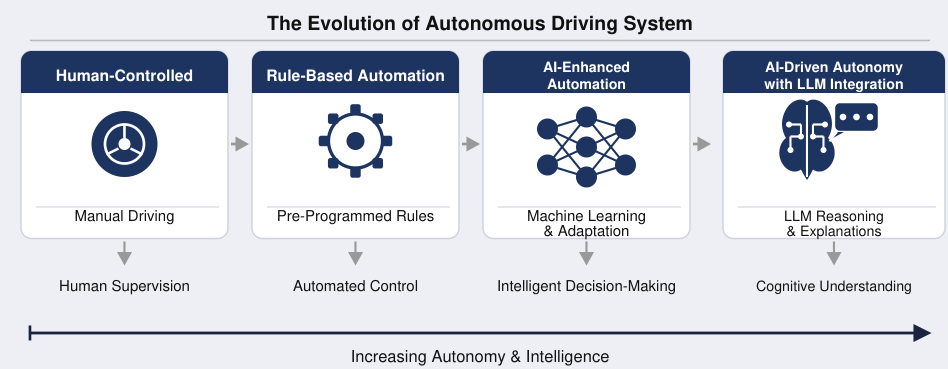</a><br><sub><b>flowchart vector cropped</b></sub><br><sub><a href="Images/CH_1/flowchart_vector_cropped.pdf">Open original PDF</a></sub></td><td align="center" width="50%"><a href="Images/CH_1/Gemini_Generated_Image_c23fnac23fnac23f.png">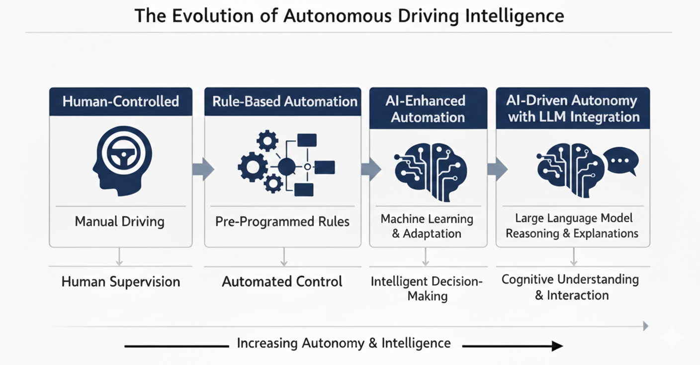</a><br><sub><b>Gemini Generated Image c23fnac23fnac23f</b></sub><br><sub><a href="Images/CH_1/Gemini_Generated_Image_c23fnac23fnac23f.png">Open full image</a></sub></td></tr>
<tr><td align="center" width="50%"><a href="Images/CH_1/History.pdf">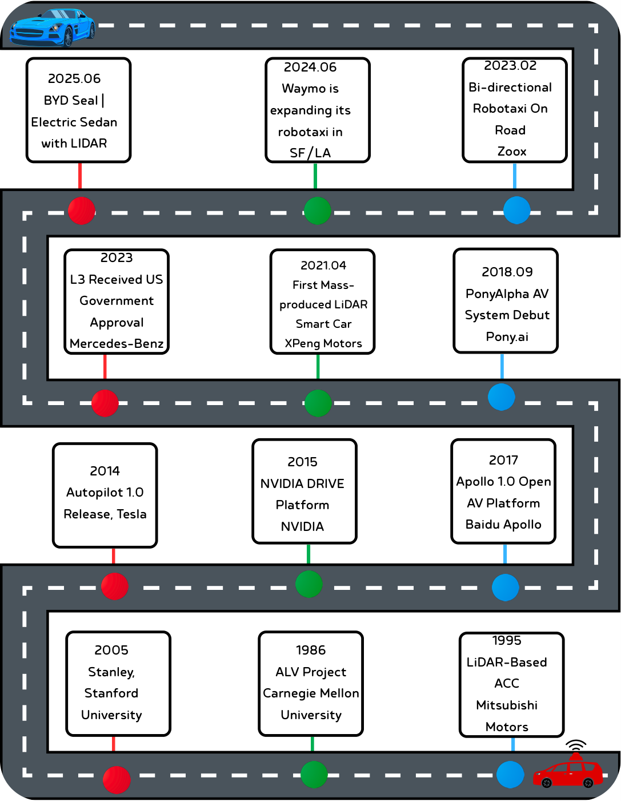</a><br><sub><b>History</b></sub><br><sub><a href="Images/CH_1/History.pdf">Open original PDF</a></sub></td><td width="50%"></td></tr>
</table>

</details>

<details>
<summary><b>CH 2</b> &nbsp; • &nbsp; 5 figures</summary>

<table>
<tr><td align="center" width="50%"><a href="Images/CH_2/algorithm_comparison.pdf">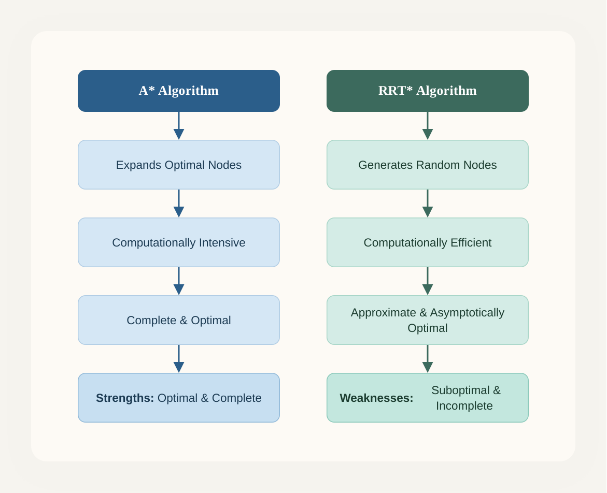</a><br><sub><b>algorithm comparison</b></sub><br><sub><a href="Images/CH_2/algorithm_comparison.pdf">Open original PDF</a></sub></td><td align="center" width="50%"><a href="Images/CH_2/explainability_spectrum_exact.pdf">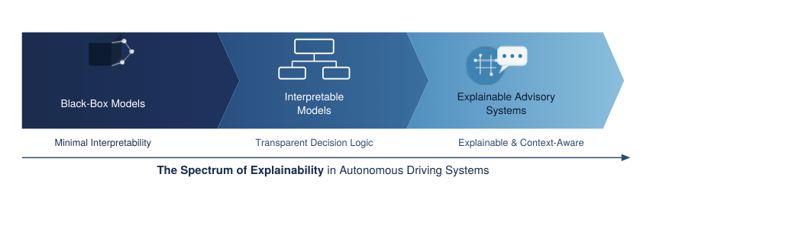</a><br><sub><b>explainability spectrum exact</b></sub><br><sub><a href="Images/CH_2/explainability_spectrum_exact.pdf">Open original PDF</a></sub></td></tr>
<tr><td align="center" width="50%"><a href="Images/CH_2/LLM_in_Avs.pdf">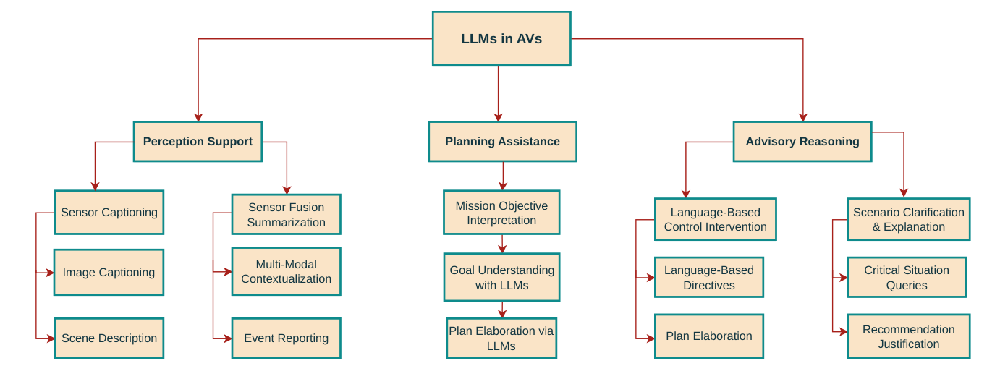</a><br><sub><b>LLM in Avs</b></sub><br><sub><a href="Images/CH_2/LLM_in_Avs.pdf">Open original PDF</a></sub></td><td align="center" width="50%"><a href="Images/CH_2/spec.pdf">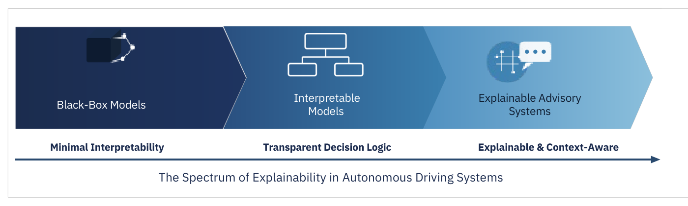</a><br><sub><b>spec</b></sub><br><sub><a href="Images/CH_2/spec.pdf">Open original PDF</a></sub></td></tr>
<tr><td align="center" width="50%"><a href="Images/CH_2/trustworthy_ai.pdf">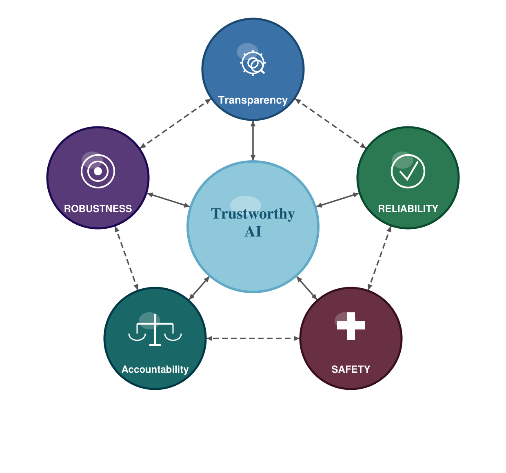</a><br><sub><b>trustworthy ai</b></sub><br><sub><a href="Images/CH_2/trustworthy_ai.pdf">Open original PDF</a></sub></td><td width="50%"></td></tr>
</table>

</details>

<details>
<summary><b>CH 3</b> &nbsp; • &nbsp; 2 figures</summary>

<table>
<tr><td align="center" width="50%"><a href="Images/CH_3/Methodology.pdf"></a><br><sub><b>Methodology</b></sub><br><sub><a href="Images/CH_3/Methodology.pdf">Open original PDF</a></sub></td><td align="center" width="50%"><a href="Images/CH_3/pipeline_diagram%20%281%29.pdf"></a><br><sub><b>pipeline diagram (1)</b></sub><br><sub><a href="Images/CH_3/pipeline_diagram%20%281%29.pdf">Open original PDF</a></sub></td></tr>
</table>

</details>

<details>
<summary><b>CH 4</b> &nbsp; • &nbsp; 16 figures</summary>

<table>
<tr><td align="center" width="50%"><a href="Images/CH_4/4.1.png"></a><br><sub><b>4.1</b></sub><br><sub><a href="Images/CH_4/4.1.png">Open full image</a></sub></td><td align="center" width="50%"><a href="Images/CH_4/4.2.png">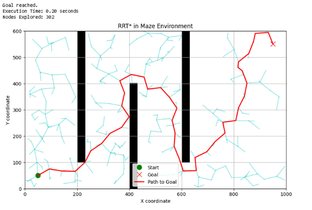</a><br><sub><b>4.2</b></sub><br><sub><a href="Images/CH_4/4.2.png">Open full image</a></sub></td></tr>
<tr><td align="center" width="50%"><a href="Images/CH_4/4.3.png">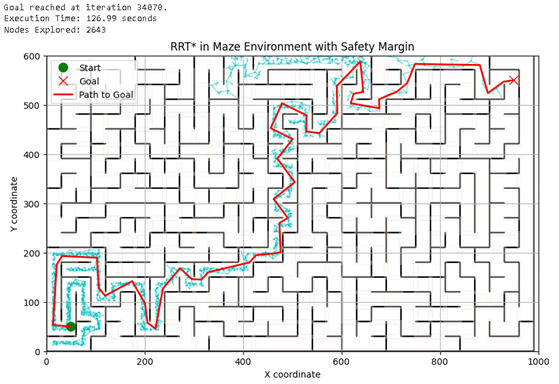</a><br><sub><b>4.3</b></sub><br><sub><a href="Images/CH_4/4.3.png">Open full image</a></sub></td><td align="center" width="50%"><a href="Images/CH_4/4.4.png">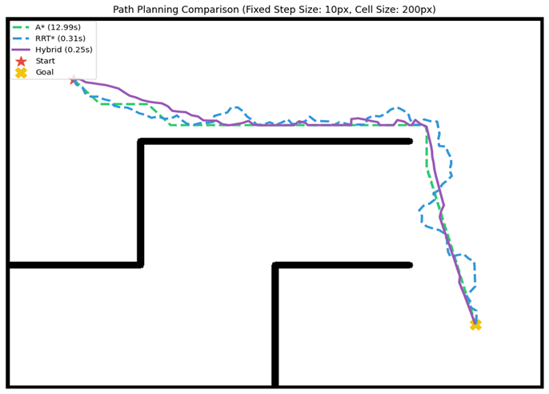</a><br><sub><b>4.4</b></sub><br><sub><a href="Images/CH_4/4.4.png">Open full image</a></sub></td></tr>
<tr><td align="center" width="50%"><a href="Images/CH_4/4.5.png">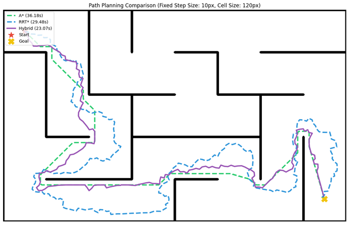</a><br><sub><b>4.5</b></sub><br><sub><a href="Images/CH_4/4.5.png">Open full image</a></sub></td><td align="center" width="50%"><a href="Images/CH_4/4.6.png">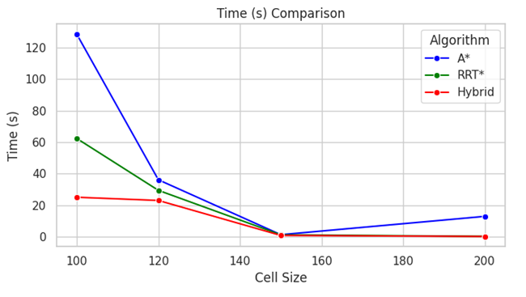</a><br><sub><b>4.6</b></sub><br><sub><a href="Images/CH_4/4.6.png">Open full image</a></sub></td></tr>
<tr><td align="center" width="50%"><a href="Images/CH_4/4.7.png">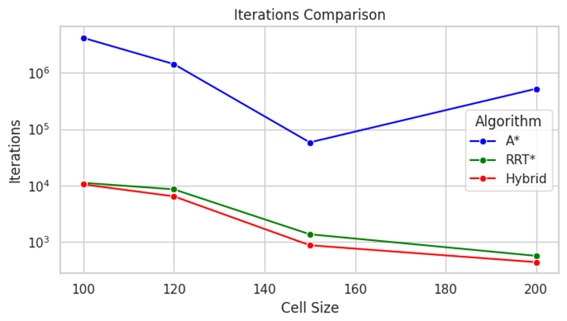</a><br><sub><b>4.7</b></sub><br><sub><a href="Images/CH_4/4.7.png">Open full image</a></sub></td><td align="center" width="50%"><a href="Images/CH_4/4.8.png">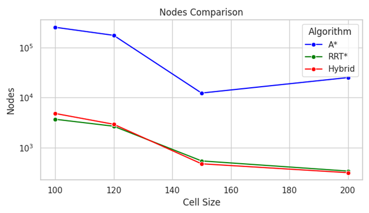</a><br><sub><b>4.8</b></sub><br><sub><a href="Images/CH_4/4.8.png">Open full image</a></sub></td></tr>
<tr><td align="center" width="50%"><a href="Images/CH_4/4.9.png">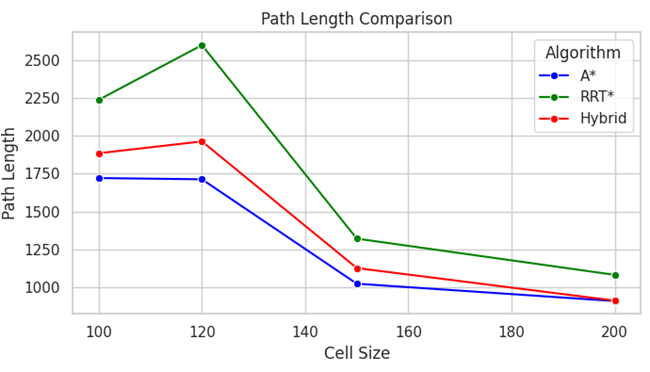</a><br><sub><b>4.9</b></sub><br><sub><a href="Images/CH_4/4.9.png">Open full image</a></sub></td><td align="center" width="50%"><a href="Images/CH_4/4.10.png">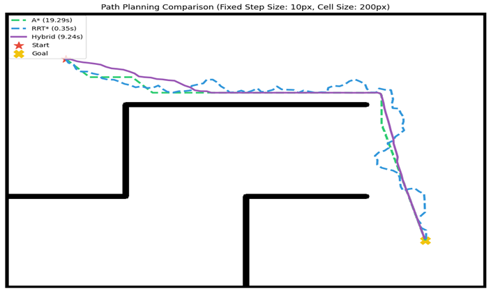</a><br><sub><b>4.10</b></sub><br><sub><a href="Images/CH_4/4.10.png">Open full image</a></sub></td></tr>
<tr><td align="center" width="50%"><a href="Images/CH_4/4.11.png">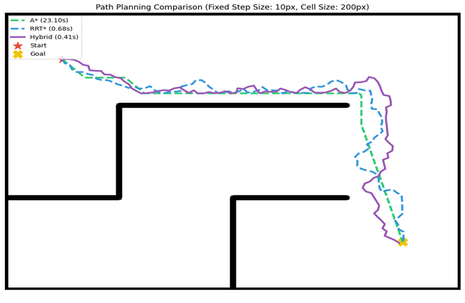</a><br><sub><b>4.11</b></sub><br><sub><a href="Images/CH_4/4.11.png">Open full image</a></sub></td><td align="center" width="50%"><a href="Images/CH_4/4.12.png">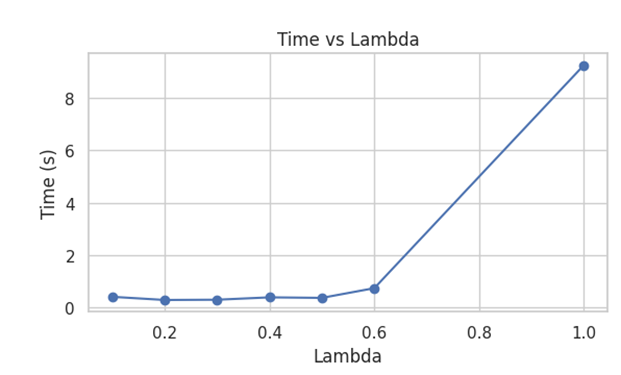</a><br><sub><b>4.12</b></sub><br><sub><a href="Images/CH_4/4.12.png">Open full image</a></sub></td></tr>
<tr><td align="center" width="50%"><a href="Images/CH_4/4.13.png">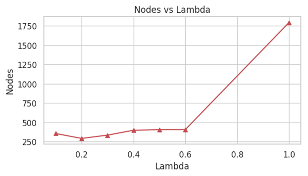</a><br><sub><b>4.13</b></sub><br><sub><a href="Images/CH_4/4.13.png">Open full image</a></sub></td><td align="center" width="50%"><a href="Images/CH_4/4.14.png">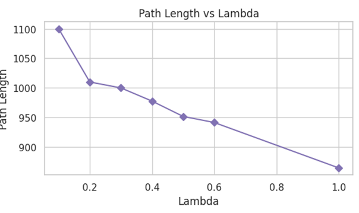</a><br><sub><b>4.14</b></sub><br><sub><a href="Images/CH_4/4.14.png">Open full image</a></sub></td></tr>
<tr><td align="center" width="50%"><a href="Images/CH_4/Table_1.png">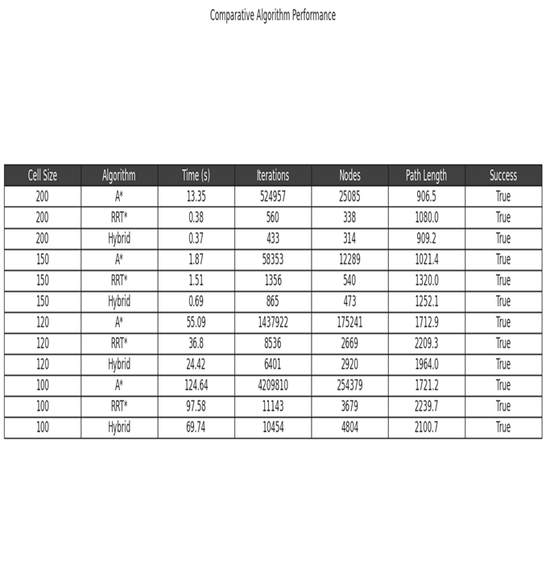</a><br><sub><b>Table 1</b></sub><br><sub><a href="Images/CH_4/Table_1.png">Open full image</a></sub></td><td align="center" width="50%"><a href="Images/CH_4/Table_2.png">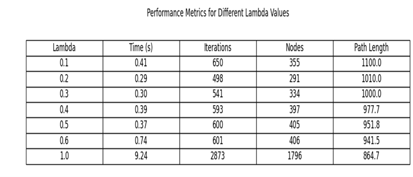</a><br><sub><b>Table 2</b></sub><br><sub><a href="Images/CH_4/Table_2.png">Open full image</a></sub></td></tr>
</table>

</details>

<details>
<summary><b>CH 5</b> &nbsp; • &nbsp; 14 figures</summary>

<table>
<tr><td align="center" width="50%"><a href="Images/CH_5/Figure%205.1.png"></a><br><sub><b>Figure 5.1</b></sub><br><sub><a href="Images/CH_5/Figure%205.1.png">Open full image</a></sub></td><td align="center" width="50%"><a href="Images/CH_5/Figure%205.2.jpg"></a><br><sub><b>Figure 5.2</b></sub><br><sub><a href="Images/CH_5/Figure%205.2.jpg">Open full image</a></sub></td></tr>
<tr><td align="center" width="50%"><a href="Images/CH_5/Figure%205.3.jpg"></a><br><sub><b>Figure 5.3</b></sub><br><sub><a href="Images/CH_5/Figure%205.3.jpg">Open full image</a></sub></td><td align="center" width="50%"><a href="Images/CH_5/Figure%205.4.png"></a><br><sub><b>Figure 5.4</b></sub><br><sub><a href="Images/CH_5/Figure%205.4.png">Open full image</a></sub></td></tr>
<tr><td align="center" width="50%"><a href="Images/CH_5/Figure%205.5.png"></a><br><sub><b>Figure 5.5</b></sub><br><sub><a href="Images/CH_5/Figure%205.5.png">Open full image</a></sub></td><td align="center" width="50%"><a href="Images/CH_5/figure%205.6.png"></a><br><sub><b>figure 5.6</b></sub><br><sub><a href="Images/CH_5/figure%205.6.png">Open full image</a></sub></td></tr>
<tr><td align="center" width="50%"><a href="Images/CH_5/Figure%205.7.png"></a><br><sub><b>Figure 5.7</b></sub><br><sub><a href="Images/CH_5/Figure%205.7.png">Open full image</a></sub></td><td align="center" width="50%"><a href="Images/CH_5/Figure%205.8.PNG"></a><br><sub><b>Figure 5.8</b></sub><br><sub><a href="Images/CH_5/Figure%205.8.PNG">Open full image</a></sub></td></tr>
<tr><td align="center" width="50%"><a href="Images/CH_5/Figure%205.9.PNG"></a><br><sub><b>Figure 5.9</b></sub><br><sub><a href="Images/CH_5/Figure%205.9.PNG">Open full image</a></sub></td><td align="center" width="50%"><a href="Images/CH_5/Figure%205.10.PNG"></a><br><sub><b>Figure 5.10</b></sub><br><sub><a href="Images/CH_5/Figure%205.10.PNG">Open full image</a></sub></td></tr>
<tr><td align="center" width="50%"><a href="Images/CH_5/Figure%205.11.PNG"></a><br><sub><b>Figure 5.11</b></sub><br><sub><a href="Images/CH_5/Figure%205.11.PNG">Open full image</a></sub></td><td align="center" width="50%"><a href="Images/CH_5/Figure%205.12.pdf"></a><br><sub><b>Figure 5.12</b></sub><br><sub><a href="Images/CH_5/Figure%205.12.pdf">Open original PDF</a></sub></td></tr>
<tr><td align="center" width="50%"><a href="Images/CH_5/Figure%205.13.pdf"></a><br><sub><b>Figure 5.13</b></sub><br><sub><a href="Images/CH_5/Figure%205.13.pdf">Open original PDF</a></sub></td><td align="center" width="50%"><a href="Images/CH_5/Figure%205.14.pdf"></a><br><sub><b>Figure 5.14</b></sub><br><sub><a href="Images/CH_5/Figure%205.14.pdf">Open original PDF</a></sub></td></tr>
</table>

</details>

<details>
<summary><b>CH 6</b> &nbsp; • &nbsp; 19 figures</summary>

<table>
<tr><td align="center" width="50%"><a href="Images/CH_6/6.1.pdf"></a><br><sub><b>6.1</b></sub><br><sub><a href="Images/CH_6/6.1.pdf">Open original PDF</a></sub></td><td align="center" width="50%"><a href="Images/CH_6/6.2.jpeg">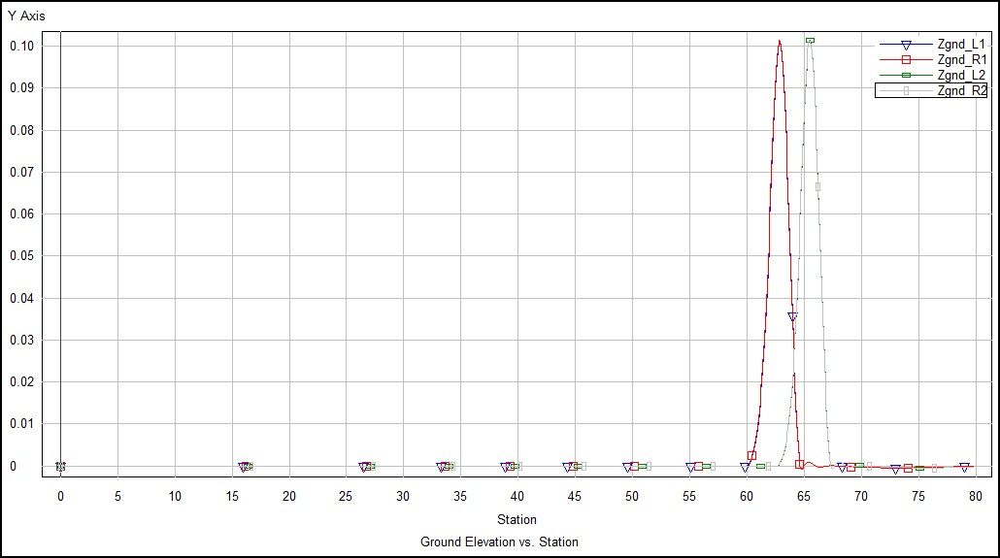</a><br><sub><b>6.2</b></sub><br><sub><a href="Images/CH_6/6.2.jpeg">Open full image</a></sub></td></tr>
<tr><td align="center" width="50%"><a href="Images/CH_6/6.3.jpeg">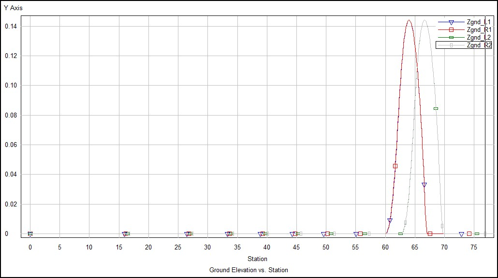</a><br><sub><b>6.3</b></sub><br><sub><a href="Images/CH_6/6.3.jpeg">Open full image</a></sub></td><td align="center" width="50%"><a href="Images/CH_6/6.4.pdf">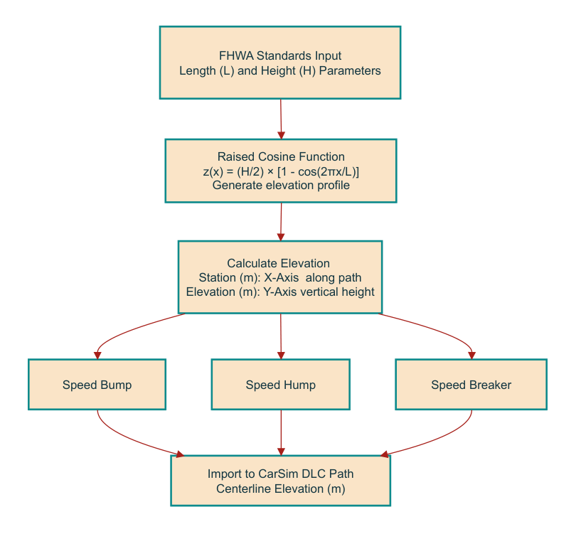</a><br><sub><b>6.4</b></sub><br><sub><a href="Images/CH_6/6.4.pdf">Open original PDF</a></sub></td></tr>
<tr><td align="center" width="50%"><a href="Images/CH_6/6.5.pdf">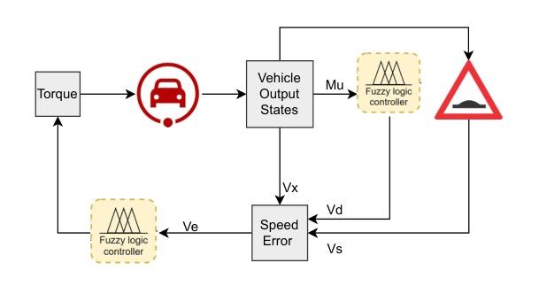</a><br><sub><b>6.5</b></sub><br><sub><a href="Images/CH_6/6.5.pdf">Open original PDF</a></sub></td><td align="center" width="50%"><a href="Images/CH_6/6.6.pdf">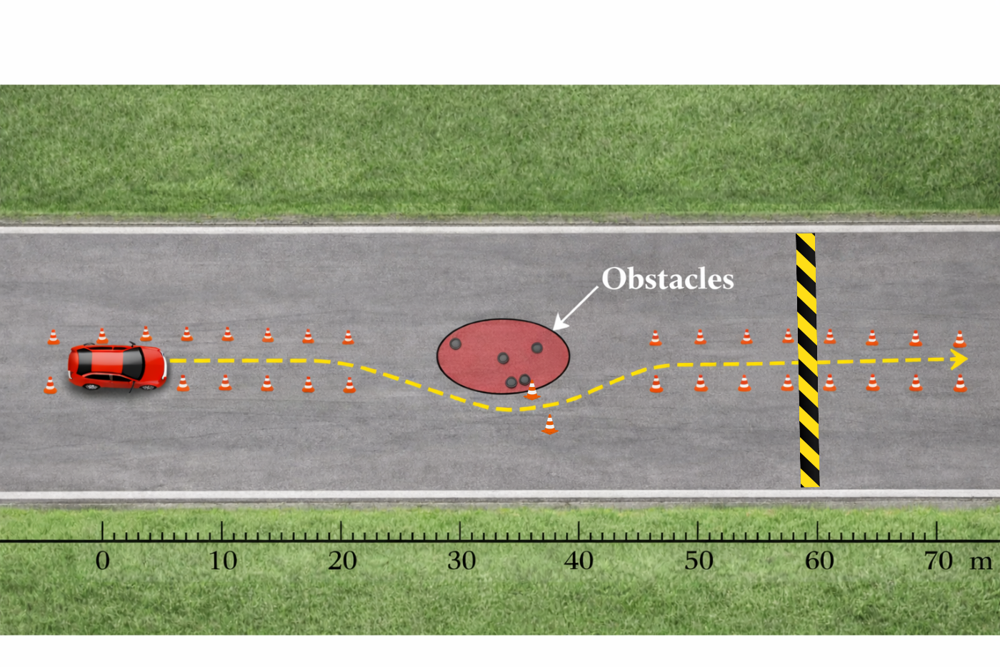</a><br><sub><b>6.6</b></sub><br><sub><a href="Images/CH_6/6.6.pdf">Open original PDF</a></sub></td></tr>
<tr><td align="center" width="50%"><a href="Images/CH_6/6.7.pdf">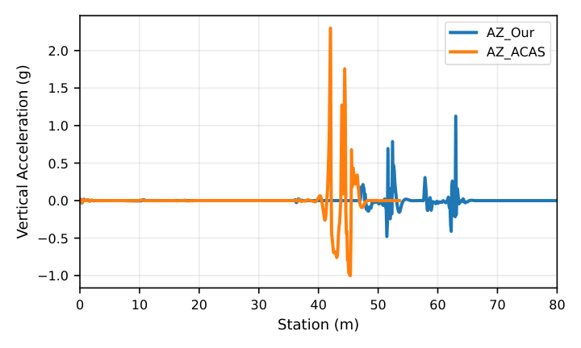</a><br><sub><b>6.7</b></sub><br><sub><a href="Images/CH_6/6.7.pdf">Open original PDF</a></sub></td><td align="center" width="50%"><a href="Images/CH_6/6.8.pdf">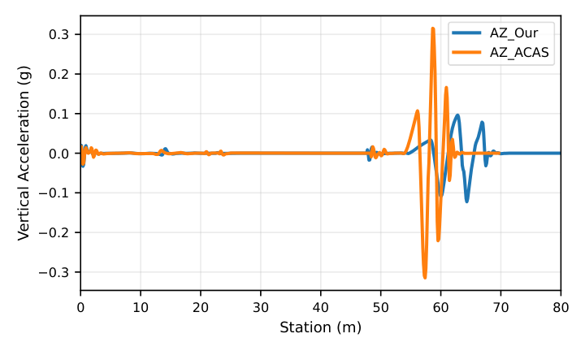</a><br><sub><b>6.8</b></sub><br><sub><a href="Images/CH_6/6.8.pdf">Open original PDF</a></sub></td></tr>
<tr><td align="center" width="50%"><a href="Images/CH_6/6.9.pdf">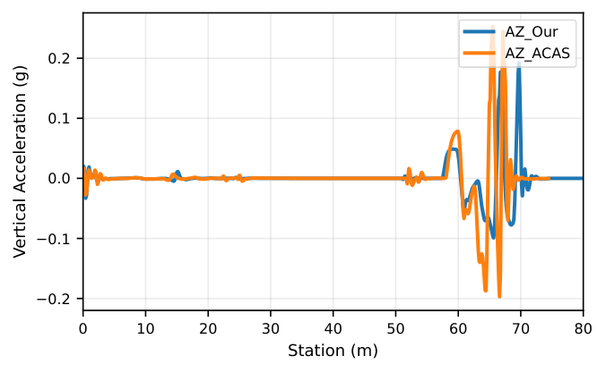</a><br><sub><b>6.9</b></sub><br><sub><a href="Images/CH_6/6.9.pdf">Open original PDF</a></sub></td><td align="center" width="50%"><a href="Images/CH_6/6.10.pdf">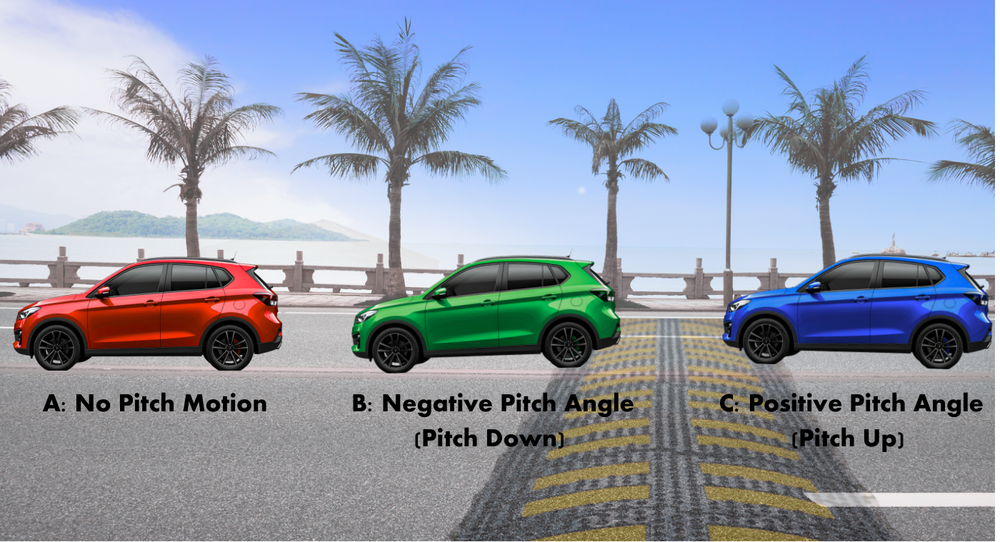</a><br><sub><b>6.10</b></sub><br><sub><a href="Images/CH_6/6.10.pdf">Open original PDF</a></sub></td></tr>
<tr><td align="center" width="50%"><a href="Images/CH_6/6.11.pdf">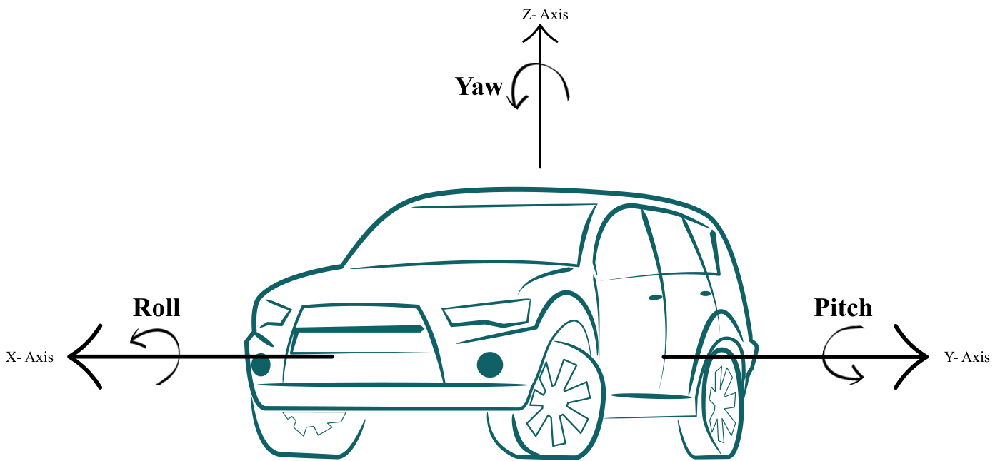</a><br><sub><b>6.11</b></sub><br><sub><a href="Images/CH_6/6.11.pdf">Open original PDF</a></sub></td><td align="center" width="50%"><a href="Images/CH_6/6.12.pdf">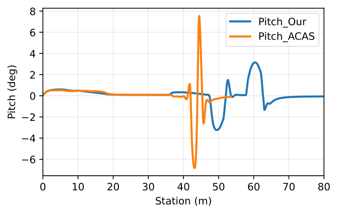</a><br><sub><b>6.12</b></sub><br><sub><a href="Images/CH_6/6.12.pdf">Open original PDF</a></sub></td></tr>
<tr><td align="center" width="50%"><a href="Images/CH_6/6.13.pdf">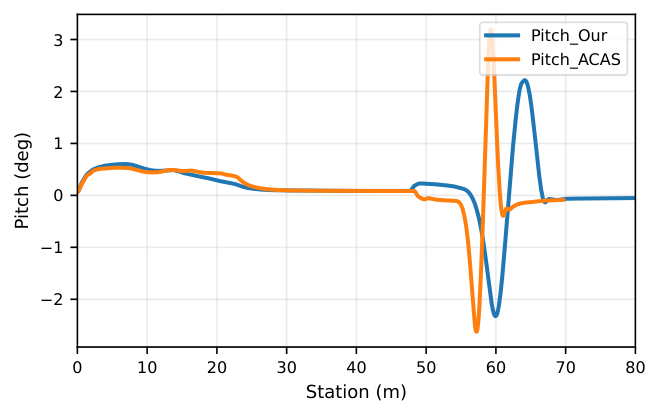</a><br><sub><b>6.13</b></sub><br><sub><a href="Images/CH_6/6.13.pdf">Open original PDF</a></sub></td><td align="center" width="50%"><a href="Images/CH_6/6.14.pdf">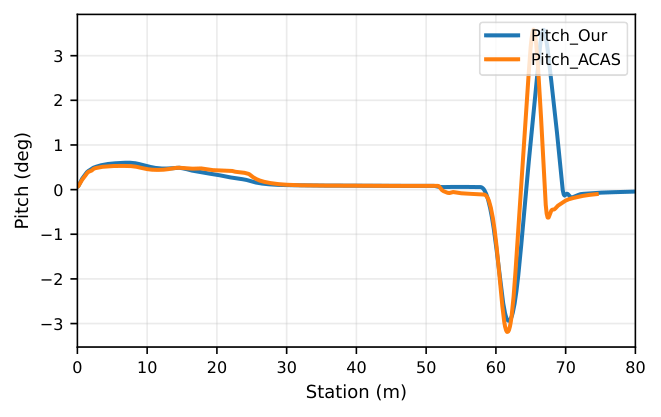</a><br><sub><b>6.14</b></sub><br><sub><a href="Images/CH_6/6.14.pdf">Open original PDF</a></sub></td></tr>
<tr><td align="center" width="50%"><a href="Images/CH_6/6.15.pdf">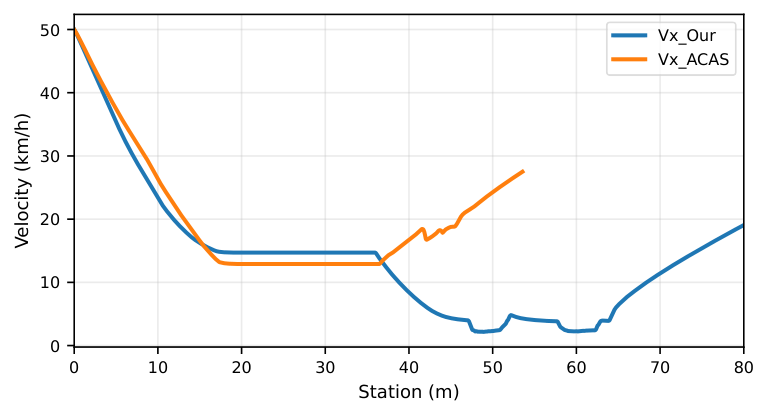</a><br><sub><b>6.15</b></sub><br><sub><a href="Images/CH_6/6.15.pdf">Open original PDF</a></sub></td><td align="center" width="50%"><a href="Images/CH_6/6.16.pdf">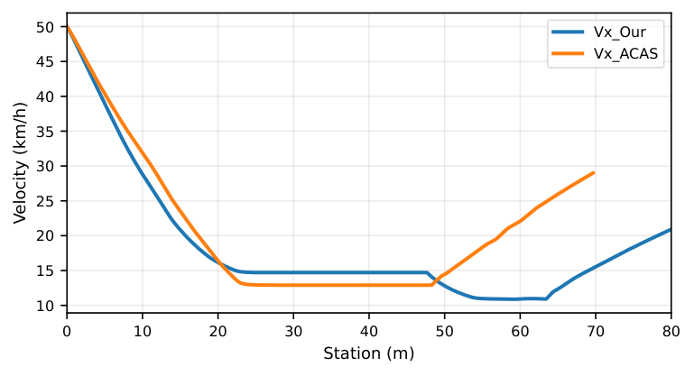</a><br><sub><b>6.16</b></sub><br><sub><a href="Images/CH_6/6.16.pdf">Open original PDF</a></sub></td></tr>
<tr><td align="center" width="50%"><a href="Images/CH_6/6.17.pdf">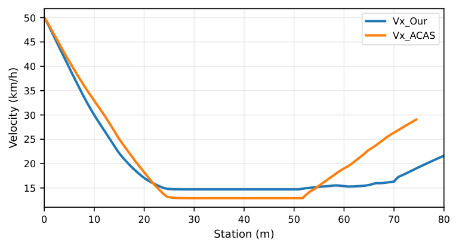</a><br><sub><b>6.17</b></sub><br><sub><a href="Images/CH_6/6.17.pdf">Open original PDF</a></sub></td><td align="center" width="50%"><a href="Images/CH_6/6.18.pdf">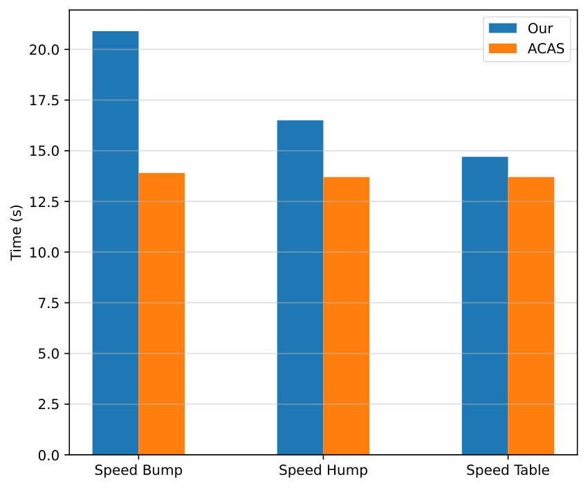</a><br><sub><b>6.18</b></sub><br><sub><a href="Images/CH_6/6.18.pdf">Open original PDF</a></sub></td></tr>
<tr><td align="center" width="50%"><a href="Images/CH_6/carsim_matlab.drawio%20%281%29%20%281%29.pdf"></a><br><sub><b>carsim matlab.drawio (1) (1)</b></sub><br><sub><a href="Images/CH_6/carsim_matlab.drawio%20%281%29%20%281%29.pdf">Open original PDF</a></sub></td><td width="50%"></td></tr>
</table>

</details>

## Project Structure

```text
Integration-of-LLM-with-Conventional-Systems-for-Autonomous-Vehicles/
├── README.md
├── main.tex
├── first.tex
├── mybib.bib
├── nust-logo.png
├── Amna_MAhmood_final_Thesis.pdf
├── Images/
│   ├── CH_1/
│   ├── CH_2/
│   ├── CH_3/
│   ├── CH_4/
│   ├── CH_5/
│   └── CH_6/
└── docs/
    └── previews/
```

## Working With the Thesis

The editable thesis is maintained in LaTeX. Original figures remain inside their chapter folders, while the generated preview directory exists only to make PDF based figures visible directly in the GitHub README.

## Author

**Amna Mahmood**

---

## Copyright

Copyright © 2026 **Amna Mahmood**. All rights reserved.

This repository is shared for academic review and portfolio purposes. See [COPYRIGHT.md](COPYRIGHT.md) for details.


---

<p align="center"><sub>Research repository prepared for clear review, reproducibility, and portfolio presentation.</sub></p>
